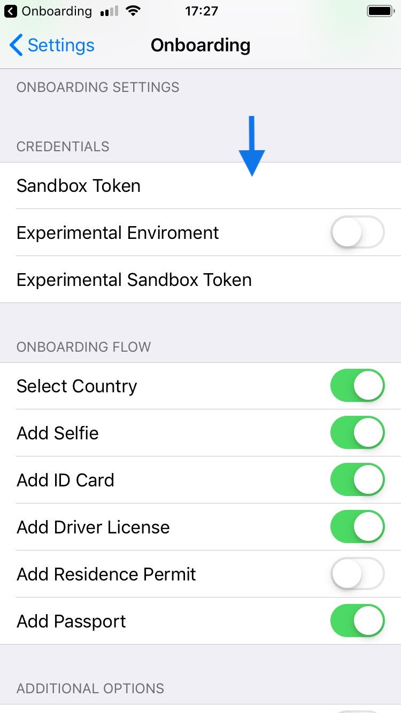

# onboarding-ios 
[](https://github.com/alice-biometrics/onboarding-ios)
[](https://github.com/alice-biometrics/onboarding-ios)
[](https://github.com/alice-biometrics/onboarding-ios)
[](https://docs.alicebiometrics.com/onboarding/) 
[](https://docs.alicebiometrics.com/onboarding/sdk/ios/)

ALiCE Onboarding iOS component allows the automatic capture of documents and video selfie of the user in real time from the camera of your device. It also simplifies the communication with the onboarding API to facilitate rapid integration and development. It manages the onboarding flow configuration: requested documents and order.

The main features are:

- Automatic capture of documents and video selfie of the user in real time from the camera of your device.
- Communication with the onboarding API to facilitate rapid integration and development.
- Manage the onboarding flow configuration: requested documents and order.

## Table of Contents
- [Installation :computer:](#installation-computer)
- [Getting Started :chart_with_upwards_trend:](#getting-started-chart_with_upwards_trend)
  * [Import the library](#import-the-library)
  * [Configuration](#configuration)
  * [Run ALiCE Onboarding](#run-alice-onboarding)
- [Authentication :closed_lock_with_key:](#authentication-closed_lock_with_key)
  * [Trial](#trial)
  * [Production](#production)
- [Demo :rocket:](#demo-rocket)
- [Customisation :gear:](#customisation-gear)
- [Documentation :page_facing_up:](#documentation-page_facing_up)
- [Contact :mailbox_with_mail:](#contact-mailbox_with_mail)


## Installation :computer:

**Using Cocoapods**

The AliceOnboarding component is available on Cocoapods. Add AliceOnboarding to your projects adding to your `Podfile` the following code:

```
pod 'AliceOnboarding'
```

Install with:

```console
pod repo update
pod install
```

## Getting Started :chart_with_upwards_trend:

### Import the library

```swift
import AliceOnboarding
```

### Configuration

You can configure the onboarding flow with the following code:

```swift
let userToken = "<ADD-YOUR-USER-TOKEN-HERE>"

let config = OnboardingConfig.builder()
  .withUserToken(userToken)
  .withAddSelfieStage()
  .withAddDocumentStage(ofType: .idcard, issuingCountry: "ESP")
  .withAddDocumentStage(ofType: .driverlicense, issuingCountry: "ESP")
```

Where `userToken` is used to secure requests made by the users on their mobile devices or web clients. You should obtain it from your Backend (see [Authentication :closed_lock_with_key:](#authentication-closed_lock_with_key)).


### Run ALiCE Onboarding

Once you configured the ALiCE Onboarding Flow, you can run the process with:

```swift
let onboarding = Onboarding(self, config: config)
onboarding.run { result in
    switch result {
    case let .success(userStatus):
        print("userStatus: \(String(describing: userStatus))")
    case let .failure(error):
        print("failure: \(error.localizedDescription)")
    case .cancel:
        print("User has cancelled the onboarding")
    }
}
```

## Authentication :closed_lock_with_key:

How can we get the `userToken` to start testing ALiCE Onboarding technology?

`AliceOnboarding` can be used with two differnet authentication modes:

* Trial (Using ALiCE Onboarding Sandbox): Recommended only in the early stages of integration.
    - Pros: This mode do not need backend integration.
    - Cons: Security compromises. It must be used only for develpment and testing.
* Production (Using your Backend): In a production deployment we strongly recommend to use your backend to obtain required TOKENS.
    - Pros: Full security level. Only your backend is able to do critical operations.
    - Cons: Needs some integration in your backend.

### Trial

If you want to test the technology without integrate it with your backend, you can use our Sandbox Service. This service associates a user mail with the ALiCE Onboarding `user_id`. You can create a user and obtain its `USER_TOKEN` already linked with the email.

Use the `SandboxAuthenticator` class to ease the integration.

```swift
let sandboxToken = "<ADD-YOUR-SANDBOX-TOKEN-HERE>"
let userInfo = UserInfo(email: email, // required
                        firstName: firstName, // optional 
                        lastName: lastName)  // optional 
                        
let authenticator = SandboxAuthenticator(sandboxToken: sandboxToken, userInfo: userInfo)

authenticator.execute { result in
    switch result {
    case .success(let userToken):
       // Configure ALiCE Onboarding with the OnboardingConfig
       // Then Run the ALiCE Onboarding Flow
    case .failure(let error):
       // Inform the user about Authentication Errors
    }
}
```

The `sandboxToken` is a temporal token for testing the technology in a development/testing environment. 

An `email` parameter in `UserInfo` is required to associate it to an ALiCE Onboarding `user_id`. You can also add some additional information from your user as `firstName` and `lastName`.

See the authentication options [here](AppOnboardingSample/AppOnboardingSample/MainView/MainViewController+Auth.swift)

For more information about the Sandbox, please check the following [doc](https://docs.alicebiometrics.com/onboarding/access.html#using-alice-onboarding-sandbox).

### Production

On the other hand, for a production environments we strongly recommend to use your backend to obtain the required `USER_TOKEN`.

You can implement the `Authenticator` protocol available in the `AliceOnboarding` framework.

```swift
class MyBackendAuthenticator : Authenticator {
    
    func execute(completion: @escaping Response<String, AuthenticationError>){
        
        // Add here your code to retrieve the user token from your backend
        
        let userToken = "fakeUserToken"
        completion(.success(userToken))
    }
}
```

In a very similar way to the authentication available with the sandbox:

```swift
                        
let authenticator = MyBackendAuthenticator()

authenticator.execute { result in
    switch result {
    case .success(let userToken):
       // Configure ALiCE Onboarding with the OnboardingConfig
       // Then Run the ALiCE Onboarding Flow
    case .failure(let error):
       // Inform the user about Authentication Errors
    }
}
```


## Demo :rocket:

Check our iOS demo in this repo (`AppOnboardingSample` folder). 

Intall cocoapods dependencies with:

```console
cd AppOnboardingSample
pod install
```

Open the Xcode workspace

```console
open AppOnboardingSample.xcworkspace
```

#### App

Add your `SANDBOX_TOKEN` credentials in `Settings -> CREDENTIALS -> Sandbox Token` 




## Customisation :gear:


Please, visit the doc.

https://docs.alicebiometrics.com/onboarding/sdk/ios/customisation.html


## Documentation :page_facing_up:

For more information about ALiCE Onboarding:  https://docs.alicebiometrics.com/onboarding/

## Contact :mailbox_with_mail:

support@alicebiometrics.com

